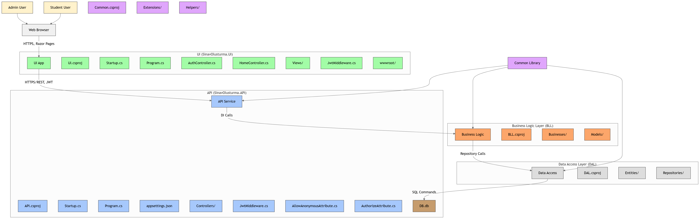

# SinavOlusturma 📝

[](https://deepwiki.com/ahmadmdabit/SinavOlusturma)
[](https://dotnet.microsoft.com/)
[](LICENSE.md)

## 📋 Table of Contents
- [Overview](#overview)
- [Architecture](#architecture)
- [Features](#features)
- [Diagram](#diagram)
- [Tech Stack](#tech-stack)
- [Getting Started](#getting-started)
  - [Prerequisites](#prerequisites)
  - [Installation](#installation)
  - [Running the Application](#running-the-application)
  - [Database Setup](#database-setup)
- [Project Structure](#project-structure)
- [API Documentation](#api-documentation)
- [License](#license)

## 📖 Overview

SinavOlusturma is a comprehensive exam creation and management system built with modern .NET technologies. It follows an N-Tier architecture pattern with a clean separation of concerns, making it highly maintainable and scalable.

The application consists of two main components:
- **Backend API**: A RESTful web API with JWT authentication and Swagger documentation
- **Frontend Web**: An ASP.NET Core MVC application with Razor views for the user interface

## 🏗️ Architecture

The application follows a traditional N-Tier architecture pattern:

```
UI (Frontend) ←→ API (Backend) ←→ BLL ←→ DAL ←→ Database
     ↑                              ↑
     └──────────────────────────────┘
                  Common (Shared)
```

### Layers:
1. **Common Layer**: Shared components, attributes, constants, and extensions
2. **DAL (Data Access Layer)**: Database operations using Dapper ORM
3. **BLL (Business Logic Layer)**: Business logic implementation
4. **API (Backend)**: RESTful API with JWT authentication
5. **UI (Frontend)**: MVC application with Razor views

## ✨ Features

- 🔐 **User Authentication**: Secure JWT-based authentication with role-based access control
- 📝 **Exam Management**: Create, read, update, and delete exams with questions and answers
- 👥 **User Roles**: Admin and normal user roles with different permissions
- 📊 **Exam Tracking**: Track user attendance and performance on exams
- 📱 **Responsive Design**: Mobile-friendly interface
- 📚 **API Documentation**: Interactive Swagger UI
- 🔍 **Web Scraping**: Integrated web scraping capabilities using HtmlAgilityPack

## 📊 Diagram

[](https://gitdiagram.com/ahmadmdabit/SinavOlusturma)



## 🧰 Tech Stack

| Layer | Technology |
|-------|------------|
| **Framework** | ASP.NET Core 3.1 |
| **Language** | C# |
| **Architecture** | N-Tier |
| **Authentication** | JWT Bearer Tokens |
| **Database** | SQLite (Dapper ORM) |
| **Frontend** | ASP.NET Core MVC (Razor Views) |
| **API Documentation** | Swagger/OpenAPI |
| **Web Scraping** | HtmlAgilityPack |

## 🚀 Getting Started

### Prerequisites

- [.NET Core 3.1 SDK](https://dotnet.microsoft.com/download/dotnet-core/3.1)
- Visual Studio or Visual Studio Code

### Installation

1. Clone the repository:
   ```bash
   git clone https://github.com/ahmadmdabit/SinavOlusturma.git
   cd SinavOlusturma
   ```

2. Restore dependencies:
   ```bash
   dotnet restore
   ```

### Running the Application

#### Backend API
```bash
cd API
dotnet run
```
- **API Endpoint**: `https://localhost:44393`
- **Swagger UI**: Available at `/swagger`

#### Frontend Web
```bash
cd UI
dotnet run
```
- **Web Interface**: `https://localhost:44317`

### Database Setup

The application uses SQLite with a pre-configured database file:

- **Database file**: `API/App_Data/DB.db`
- **Connection string**: `Data Source={path_to_project}\\API\\App_Data\\DB.db;Cache=Shared;`

Ensure the connection string in `API/appsettings.json` points to the correct database file location on your machine.

## 📁 Project Structure

```
SinavOlusturma\
├── API\           # RESTful API backend
├── BLL\           # Business Logic Layer
├── Common\        # Common components
├── DAL\           # Data Access Layer
└── UI\            # Web frontend (MVC)
```

## 👤 Login Information

- **Admin User**: 
  - Username: `admin`
  - Password: `321`
- **Normal User**: 
  - Username: `demo`
  - Password: `123`

## 📚 API Documentation

The API is documented using Swagger/OpenAPI. Once the API is running, you can access the interactive documentation at:

```
https://localhost:44393/swagger
```

The documentation provides:
- Complete endpoint list
- Request/response schemas
- Interactive testing interface
- JWT authentication support

## 📝 Usage Notes

1. Ensure the SQL connection string in `appsettings.json` in the API project is correct for your machine.
2. Ensure that both the API project and the UI project are set as startup projects in Visual Studio.
3. The home page displays a list of all exams, where you can show, create, edit, or delete any exam.
4. When logging in with normal user credentials, you will be redirected to the Student/Exams page, which shows exams the user has attended.
5. To assign a user to an exam, open the Home page with admin credentials and press the grey button with the heman icon to open the student exam page. Then share the link with the student.
6. Students cannot attend an exam if they are not logged into the application.

## 📄 License

Licensed under the [MIT license](LICENSE.md).